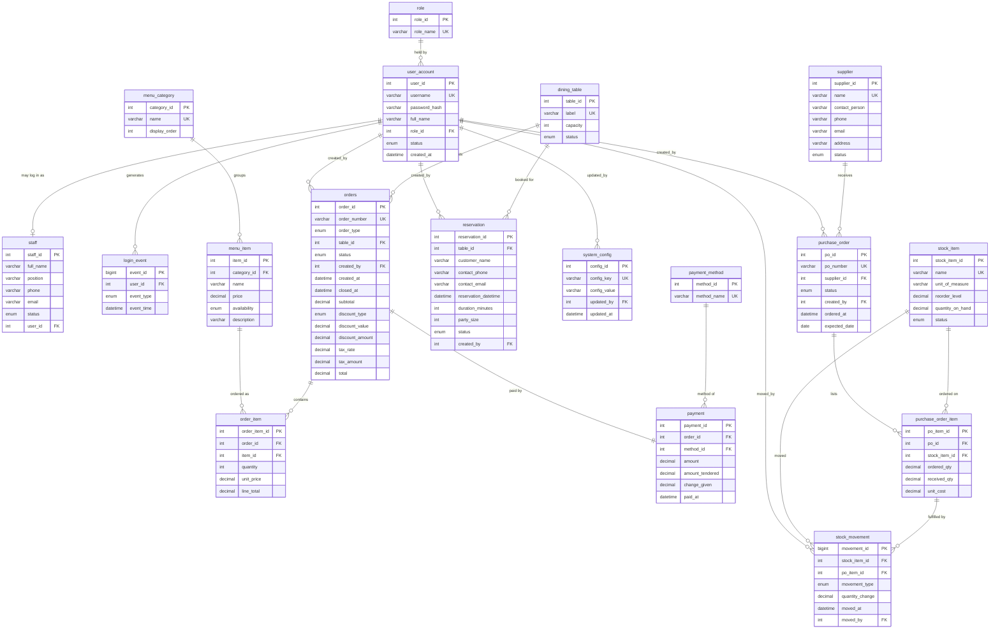

# Technical Design Document (TDD)
## Restaurant Management System (RMS)

| Field | Value | Field | Value |
|---|---|---|---|
| **Document** | Technical Design Document (TDD) | **Version** | 1.0 (Draft for review) |
| **Date** | 8 July 2026 | **Classification** | Confidential |
| **Prepared by** | Project Team | **Traces to** | BRD v1.0 · FRD v1.0 |
| **Phase** | Phase 1 (Desktop) → Phase 2 (Web) | **Status** | Draft for review |

> Software architecture, database (ERD & schema), component and security design derived from the approved BRD v1.0 and FRD v1.0.

---

## Table of Contents

1. [Document Control & Introduction](#1-document-control--introduction)
2. [System Architecture](#2-system-architecture)
3. [Database Design — Entity-Relationship Model](#3-database-design--entity-relationship-model)
4. [Component & Module Design](#4-component--module-design)
5. [State Models & Key Algorithms](#5-state-models--key-algorithms)
6. [Key Process Flows (Sequence Design)](#6-key-process-flows-sequence-design)
7. [Cross-Cutting Design](#7-cross-cutting-design)
8. [Design Verification & Traceability](#8-design-verification--traceability)
- [Appendix A — MySQL Schema (DDL Outline)](#appendix-a--mysql-schema-ddl-outline)
- [Appendix B — Status & Enumeration Reference](#appendix-b--status--enumeration-reference)

---

## 1. Document Control & Introduction

### 1.1 Purpose of this Document

This Technical Design Document (TDD) specifies **how** the Restaurant Management System (RMS) will be built. Where the Business Requirements Document (BRD v1.0) defines *what* the business needs and the Functional Requirements Document (FRD v1.0) defines the required system *behaviour*, this TDD defines the *engineering solution*: the layered software architecture, the class and service structure of each module, the complete relational database design (entity-relationship diagram and data dictionary), the algorithms behind billing and scheduling, the security model, the error-handling and transaction strategy, and the desktop-to-web migration approach.

It is the primary reference for developers implementing the system and for reviewers confirming technical feasibility. Every design decision here is traceable back to one or more functional requirements (FR-01…FR-30), business rules (BR-01…BR-30) and non-functional requirements (NFR-01…NFR-08) defined in the parent documents.

### 1.2 Scope

The design covers the six functional modules of the RMS — Authentication & Administration, Menu & Table Management, Orders & Billing (POS), Inventory & Suppliers, Staff & Reservations, and Reporting — delivered against a single shared MySQL database. Phase 1 is an on-premise JavaFX desktop application; Phase 2 re-uses the identical business and data layers behind a web interface. Out-of-scope items (online ordering, payment-gateway processing, kitchen displays, loyalty, payroll, multi-branch, mobile app) are excluded from this design, consistent with BRD §4.2.

### 1.3 Related Documents

| Ref | Document | Relationship to this TDD |
|---|---|---|
| REF-1 | Business Requirements Document (BRD) v1.0 | Source of business objectives BO-1…BO-6 and requirements FR-01…FR-30. |
| REF-2 | Functional Requirements Document (FRD) v1.0 | Source of functional specifications, business rules BR-01…BR-30, state models and validation rules. |
| REF-3 | This Technical Design Document (TDD) v1.0 | Defines architecture, database schema, ERD, component and security design. |
| REF-4 | Test Plan & Traceability Matrix | Maps each FR / design element to verification test cases. |

### 1.4 Definitions & Acronyms

| Term | Meaning |
|---|---|
| MVC | Model–View–Controller: the architectural pattern separating data (Model), presentation (View) and coordination (Controller). |
| DAO | Data Access Object: a class that encapsulates all SQL for one aggregate/table. |
| DTO | Data Transfer Object: a lightweight, UI-framework-independent object carrying data between layers. |
| Service / Business layer | The reusable layer holding all calculation, validation and state rules — shared by desktop and web. |
| RBAC | Role-Based Access Control (Administrator, Manager, Cashier). |
| ERD | Entity-Relationship Diagram — the visual model of tables and their relationships. |
| 3NF | Third Normal Form — the relational normalisation target (NFR-07). |
| Price snapshot | The unit price copied onto an order line at order time so later menu edits never change a finalised bill (BR-15). |
| Idempotent | An operation that produces the same result if applied more than once (relevant to receipt reprints). |

### 1.5 Revision History

| Version | Date | Author | Description |
|---|---|---|---|
| 0.1 | 7 Jul 2026 | Project Team | Skeleton and architecture outline. |
| 0.9 | 8 Jul 2026 | Project Team | Full architecture, schema, ERD and component design drafted. |
| 1.0 | 8 Jul 2026 | Project Team | Complete draft released for technical review. |

---

## 2. System Architecture

### 2.1 Architectural Goals & Principles

The architecture is shaped by one dominant constraint from the BRD/FRD: the **same business logic and database must serve both a desktop (Phase 1) and a web (Phase 2) front end without being rewritten** (NFR-05, NFR-06, BO-6). Every structural decision below follows from that constraint plus the financial-integrity requirement (NFR-03) and role-based security (NFR-04).

- **Strict layering.** Presentation, business logic and data access are separate layers with one-directional dependencies (View → Controller → Service → DAO → Database). No SQL or calculation ever lives in view code.
- **UI-framework independence.** The Service and DAO layers depend only on plain Java and JDBC, never on JavaFX types, so Phase 2 can replace the View/Controller with web equivalents and reuse the lower layers unchanged.
- **Single source of truth for money.** All monetary calculation is centralised in one *BillingService* (a single billing engine), invoked inside one database transaction (BR-13, BR-16, BR-18, BR-19).
- **Defence in depth for access control.** Role checks are enforced in the business layer, not merely hidden in the UI (BR-03, FR-02).
- **Fail-safe persistence.** Financial and stock mutations run inside ACID transactions; a failure rolls back completely, leaving no partial data (NFR-03).

### 2.2 Layered (MVC + Service/DAO) Architecture

The system uses a classic MVC front end sitting on top of a reusable Service/DAO core. The five logical layers and their responsibilities are:

| Layer | Responsibility | Phase-1 technology | Reused in Phase 2? |
|---|---|---|---|
| View | Screens, widgets, user input capture, display of results. Contains no business rules. | JavaFX (FXML + CSS) | Replaced by web UI (HTML/JS) |
| Controller | Handles UI events, calls services, maps results to the view. Thin coordination only. | JavaFX controllers | Replaced by web controllers |
| Service (Business) | All calculation, validation, state transitions, RBAC checks, transaction orchestration. | Plain Java (POJOs) | **Reused unchanged** |
| DAO (Data Access) | All SQL/CRUD for each aggregate; maps rows ↔ domain objects. No business rules. | JDBC + MySQL Connector/J | **Reused unchanged** |
| Database | Persistent storage, constraints, transactions, referential integrity. | MySQL 8.x (3NF) | Same schema, same DB |

**Layered architecture (conceptual)**

```
┌─────────────────────────────────────────────────────────────┐
│  VIEW      Phase 1: JavaFX (FXML)   │  Phase 2: Web UI (HTML) │
├─────────────────────────────────────────────────────────────┤
│  CONTROLLER   UI event handling · input → service calls      │
╞═════════════════════════════════════════════════════════════╡
│  SERVICE / BUSINESS LAYER  (reusable — no UI dependency)      │
│    AuthService · MenuService · TableService · OrderService    │
│    BillingService · InventoryService · PurchasingService      │
│    ReservationService · StaffService · ReportService · RBAC   │
├─────────────────────────────────────────────────────────────┤
│  DAO LAYER   UserDAO · MenuItemDAO · OrderDAO · PaymentDAO …  │
│              (JDBC, prepared statements, transactions)        │
├─────────────────────────────────────────────────────────────┤
│  DATABASE    MySQL 8.x  ·  3NF schema  ·  shared both phases  │
└─────────────────────────────────────────────────────────────┘
```

### 2.3 Package / Module Structure (Phase 1)

The Java codebase is organised so that the reusable core (`domain`, `service`, `dao`, `util`, `config`) is physically separate from the JavaFX front end (`view` + `controller`). Top-level packages carry **no `com.rms` (or other) prefix**. At Phase 2 only the `view` and `controller` packages are replaced.

```
(no root prefix — packages sit at the source root)
├── app/           application bootstrap / entry point and wiring (Main)
├── controller/    one JavaFX controller per screen (← swapped in Phase 2)
├── view/          FXML + CSS + view-side resources (← swapped in Phase 2)
├── service/       business logic (OrderService, BillingService, …)
│   └── security/  AuthService, PasswordHasher, RbacGuard, Session
├── dao/           interfaces + JDBC implementations, ConnectionFactory
├── domain/        POJOs + enums (User, Order, OrderItem, Payment, …)
├── util/          Money, Validation, DateTime, ReportExporter
└── config/        AppConfig, DB settings, tax/reference loader
```

### 2.4 Deployment View

**Phase 1 (Desktop).** The JavaFX application runs on one or more on-premise terminals on the restaurant LAN. All terminals connect to a single MySQL server on a local machine; no internet connection is required (NFR-08). The application is a single deployable JAR plus a JRE.

**Phase 2 (Web).** The reusable service/DAO core is wrapped by a web application (e.g. servlet/Spring controllers exposing REST endpoints) served to browsers. The *same* MySQL schema is used; only the presentation tier and a thin web-controller tier are new.

| Concern | Phase 1 (Desktop) | Phase 2 (Web) |
|---|---|---|
| Client | JavaFX app on each terminal | Browser (thin client) |
| Server tier | None (client talks to DB directly on LAN) | Web/app server hosting reused core |
| Business + data layers | In-process with the client | Identical code, server-side |
| Database | MySQL on local machine/LAN | Same MySQL schema (central/hosted) |
| Connectivity | LAN only, offline-capable | HTTP(S); groundwork for multi-location |

### 2.5 Technology Stack

| Concern | Choice | Rationale |
|---|---|---|
| Language | Java **JDK 8** | Mandated baseline (constitution); proven, well-documented, JavaFX bundled in the JRE. |
| Desktop UI | JavaFX (bundled `jfxrt.jar`) + FXML/CSS | Mandated by BRD; JavaFX loaded from the JDK 8 bundled `jfxrt.jar`, one FXML + one controller per screen. |
| Persistence | MySQL 8.x via JDBC (Connector/J) | Mandated store; explicit control of transactions and SQL. |
| Data access | Hand-written DAO + prepared statements | Transparent SQL, easy 3NF mapping, no ORM lock-in. |
| Password hashing | BCrypt (or PBKDF2) | Salted, adaptive one-way hashing (NFR-04, BR-02). |
| PDF / receipts / export | A PDF library (e.g. OpenPDF/JasperReports) | Receipts and report export (FR-16, FR-30). |
| IDE / Build | **Eclipse** project | Mandated toolchain (constitution); Eclipse-managed build and dependencies. |
| Testing | JUnit 5 + Mockito | Unit-test the billing engine and rules (mitigates finance risk). |

---

## 3. Database Design — Entity-Relationship Model

### 3.1 Overview

All operational data lives in one shared MySQL database, normalised to at least Third Normal Form (NFR-07) and used unchanged by both phases. The model comprises **18 tables** covering the six modules plus reference and audit data. Key design features that satisfy the FRD business rules are: a dedicated *role* table for RBAC; price and tax *snapshots* stored on orders and order lines so history is immutable (BR-09, BR-15, BR-18); a *stock_movement* ledger so on-hand quantity only ever changes through recorded events (BR-21); and a *login_event* table feeding the staff-activity report (FR-29).

### 3.2 Entity-Relationship Diagram

The diagram uses crow's-foot notation. A bar marks the "one" end of a relationship and a crow's foot marks the "many" end; a circle denotes an optional participation. **PK** = primary key, **FK** = foreign key, **UQ** = unique constraint. Every attribute is defined in the data dictionary (§3.4).

**Rendered diagram** (high-resolution image, `rms_erd.png`):


**Mermaid ERD** (renders inline in GitHub / most markdown tools):



### 3.3 Relationship Summary

| Parent (one) | Child (many) | Type | Meaning / rule |
|---|---|---|---|
| role | user_account | 1 : N | Each user holds exactly one role (RBAC). |
| user_account | staff | 1 : 0..1 | A staff record may optionally be linked to a login account (BR-26). |
| user_account | login_event | 1 : N | Login/logout events per user (feeds FR-29). |
| user_account | orders | 1 : N | "created_by" — the cashier who opened the order (BR-14). |
| user_account | purchase_order | 1 : N | "created_by" — who raised the PO (BR-23). |
| user_account | reservation | 1 : N | Who recorded the reservation. |
| user_account | stock_movement | 1 : N | Who recorded the stock event (audit). |
| menu_category | menu_item | 1 : N | Items are grouped by category (BR-08). |
| menu_item | order_item | 1 : N | An item may appear on many order lines. |
| dining_table | orders | 1 : N | Dine-in orders reference a table (nullable for takeaway). |
| dining_table | reservation | 1 : N | Reservations are booked against a table. |
| orders | order_item | 1 : N | An order has one or more line items. |
| orders | payment | 1 : 1 | A finalised order has exactly one payment record (BR-19). |
| payment_method | payment | 1 : N | Reference list: Cash / Card / Other. |
| supplier | purchase_order | 1 : N | A supplier receives many POs (BR-22). |
| purchase_order | purchase_order_item | 1 : N | A PO lists one or more stock lines (BR-23). |
| stock_item | purchase_order_item | 1 : N | A stock item can appear on many PO lines. |
| stock_item | stock_movement | 1 : N | Every on-hand change is a movement row (BR-21, BR-24). |
| purchase_order_item | stock_movement | 1 : 0..N | A receipt movement links back to the PO line it fulfilled. |

### 3.4 Data Dictionary

Types are MySQL types. Keys: **PK** primary, **FK** foreign, **UQ** unique. NN = NOT NULL. Monetary columns use `DECIMAL(10,2)`; quantities use `INT` or `DECIMAL(10,3)` for stock measured in fractional units.

#### role
*Application roles governing permissions (RBAC).*

| Column | Type | Key / Constraint | Description |
|---|---|---|---|
| role_id | INT AUTO_INCREMENT | PK | Surrogate key. |
| role_name | VARCHAR(20) | UQ, NN | 'Administrator' \| 'Manager' \| 'Cashier'. |

#### user_account
*Login identities. Passwords are stored only as salted hashes (BR-02).*

| Column | Type | Key / Constraint | Description |
|---|---|---|---|
| user_id | INT AUTO_INCREMENT | PK | Surrogate key. |
| username | VARCHAR(50) | UQ, NN | 3–50 chars, case-insensitive login (FR-03). |
| password_hash | VARCHAR(100) | NN | BCrypt/PBKDF2 salted hash — never plain text. |
| full_name | VARCHAR(100) | NN | Display name, 2–100 chars. |
| role_id | INT | FK → role, NN | Exactly one role per user. |
| status | ENUM('Active','Inactive') | NN, default 'Active' | Deactivated accounts cannot log in (FR-03, BR-05). |
| created_at | DATETIME | NN | Account creation timestamp. |

#### staff
*Employee records, distinct from login accounts (BR-26).*

| Column | Type | Key / Constraint | Description |
|---|---|---|---|
| staff_id | INT AUTO_INCREMENT | PK | Surrogate key. |
| full_name | VARCHAR(100) | NN | Employee name. |
| position | VARCHAR(50) | NN | e.g. Cashier, Waiter, Chef. |
| phone | VARCHAR(30) | NULL | Format-validated when present. |
| email | VARCHAR(100) | NULL | Format-validated when present. |
| status | ENUM('Active','Inactive') | NN, default 'Active' | Deactivate to retain history (BR-26). |
| user_id | INT | FK → user_account, NULL | Optional link to a login account. |

#### login_event
*Session audit log; source for the staff-activity report (FR-29).*

| Column | Type | Key / Constraint | Description |
|---|---|---|---|
| event_id | BIGINT AUTO_INCREMENT | PK | Surrogate key. |
| user_id | INT | FK → user_account, NN | The user who logged in/out. |
| event_type | ENUM('LOGIN','LOGOUT') | NN | Event kind. |
| event_time | DATETIME | NN | When the event occurred. |

#### menu_category
*Groupings for menu items (FR-05).*

| Column | Type | Key / Constraint | Description |
|---|---|---|---|
| category_id | INT AUTO_INCREMENT | PK | Surrogate key. |
| name | VARCHAR(50) | UQ, NN | Unique category name, 2–50 chars (BR-08). |
| display_order | INT | NULL | Optional on-screen ordering. |

#### menu_item
*Sellable items (FR-06, FR-07).*

| Column | Type | Key / Constraint | Description |
|---|---|---|---|
| item_id | INT AUTO_INCREMENT | PK | Surrogate key. |
| category_id | INT | FK → menu_category, NN | Owning category (FR-05). |
| name | VARCHAR(80) | NN, UQ(category,name) | Unique within its category. |
| price | DECIMAL(10,2) | NN, ≥ 0 | Current price; snapshotted onto order lines (BR-09). |
| availability | ENUM('Available','Unavailable') | NN, default 'Available' | Toggle without deleting (FR-07, BR-10). |
| description | VARCHAR(255) | NULL | Optional description. |

#### dining_table
*Physical dining tables and their live status (FR-08, FR-09).*

| Column | Type | Key / Constraint | Description |
|---|---|---|---|
| table_id | INT AUTO_INCREMENT | PK | Surrogate key. |
| label | VARCHAR(10) | UQ, NN | Unique table number/label (BR-11). |
| capacity | INT | NN, ≥ 1 | Seating capacity; used for party-size checks (FR-24). |
| status | ENUM('Free','Occupied','Reserved','Needs Cleaning') | NN, default 'Free' | Live state (BR-12, Appendix B). |

#### orders
*Order header, incl. stored final financial figures (FR-10…FR-17).*

| Column | Type | Key / Constraint | Description |
|---|---|---|---|
| order_id | INT AUTO_INCREMENT | PK | Surrogate key. |
| order_number | VARCHAR(20) | UQ, NN | Human-readable unique number (BR-14). |
| order_type | ENUM('Dine-in','Takeaway') | NN | Order channel. |
| table_id | INT | FK → dining_table, NULL | Set for dine-in; NULL for takeaway. |
| status | ENUM('Open','Paid/Closed','Cancelled') | NN, default 'Open' | Lifecycle state (§5). |
| created_by | INT | FK → user_account, NN | Cashier who opened the order (BR-14). |
| created_at | DATETIME | NN | Open timestamp. |
| closed_at | DATETIME | NULL | Finalisation timestamp. |
| subtotal | DECIMAL(10,2) | NN, default 0 | Σ line totals (BR-13). |
| discount_type | ENUM('None','Percentage','Fixed') | NN, default 'None' | Discount kind (FR-13). |
| discount_value | DECIMAL(10,2) | NN, default 0 | Percentage (0–100) or fixed amount entered. |
| discount_amount | DECIMAL(10,2) | NN, default 0 | Computed money discount (BR-17). |
| tax_rate | DECIMAL(5,4) | NN | Tax rate in force at finalisation — snapshot (BR-18). |
| tax_amount | DECIMAL(10,2) | NN, default 0 | Computed tax (BR-18). |
| total | DECIMAL(10,2) | NN, default 0 | Grand total (BR-16, BR-18). |

#### order_item
*Order line items with unit-price snapshot (FR-11, BR-15).*

| Column | Type | Key / Constraint | Description |
|---|---|---|---|
| order_item_id | INT AUTO_INCREMENT | PK | Surrogate key. |
| order_id | INT | FK → orders, NN | Owning order (ON DELETE CASCADE within open order). |
| item_id | INT | FK → menu_item, NN | The menu item ordered. |
| quantity | INT | NN, ≥ 1 | Line quantity (FR-11). |
| unit_price | DECIMAL(10,2) | NN | Price snapshot at order time (BR-15). |
| line_total | DECIMAL(10,2) | NN | quantity × unit_price (BR-13). |

#### payment_method
*Reference list of payment methods (FR-15).*

| Column | Type | Key / Constraint | Description |
|---|---|---|---|
| method_id | INT AUTO_INCREMENT | PK | Surrogate key. |
| method_name | VARCHAR(20) | UQ, NN | 'Cash' \| 'Card' \| 'Other'. |

#### payment
*One payment per finalised order — recorded, not processed (FR-15, BR-19).*

| Column | Type | Key / Constraint | Description |
|---|---|---|---|
| payment_id | INT AUTO_INCREMENT | PK | Surrogate key. |
| order_id | INT | FK → orders, UQ, NN | One-to-one with the order (BR-19). |
| method_id | INT | FK → payment_method, NN | How the customer paid. |
| amount | DECIMAL(10,2) | NN | Amount due/paid (= order.total). |
| amount_tendered | DECIMAL(10,2) | NULL | Cash tendered (optional). |
| change_given | DECIMAL(10,2) | NULL | tendered − total, ≥ 0. |
| paid_at | DATETIME | NN | Payment timestamp. |

#### supplier
*Vendors used on purchase orders (FR-19).*

| Column | Type | Key / Constraint | Description |
|---|---|---|---|
| supplier_id | INT AUTO_INCREMENT | PK | Surrogate key. |
| name | VARCHAR(100) | UQ, NN | Unique supplier name (BR-22). |
| contact_person | VARCHAR(100) | NULL | Optional contact. |
| phone | VARCHAR(30) | NULL | Format-validated when present. |
| email | VARCHAR(100) | NULL | Format-validated when present. |
| address | VARCHAR(255) | NULL | Optional address. |
| status | ENUM('Active','Inactive') | NN, default 'Active' | Set Inactive rather than delete (BR-05). |

#### stock_item
*Inventory items; on-hand only changes via movements (FR-18, BR-21).*

| Column | Type | Key / Constraint | Description |
|---|---|---|---|
| stock_item_id | INT AUTO_INCREMENT | PK | Surrogate key. |
| name | VARCHAR(80) | UQ, NN | Unique stock name (BR-21). |
| unit_of_measure | VARCHAR(20) | NN | e.g. kg, L, unit, bottle. |
| reorder_level | DECIMAL(10,3) | NN, ≥ 0 | Low-stock threshold (BR-25). |
| quantity_on_hand | DECIMAL(10,3) | NN, ≥ 0 | System-maintained current stock. |
| status | ENUM('Active','Inactive') | NN, default 'Active' | Deactivate to preserve history (BR-05). |

#### purchase_order
*PO header (FR-20, FR-21).*

| Column | Type | Key / Constraint | Description |
|---|---|---|---|
| po_id | INT AUTO_INCREMENT | PK | Surrogate key. |
| po_number | VARCHAR(20) | UQ, NN | Unique PO number (BR-23). |
| supplier_id | INT | FK → supplier, NN | Supplier the PO is raised to. |
| status | ENUM('Ordered','Partially Received','Received','Cancelled') | NN, default 'Ordered' | Lifecycle (§5). |
| created_by | INT | FK → user_account, NN | Who raised the PO. |
| ordered_at | DATETIME | NN | Creation timestamp. |
| expected_date | DATE | NULL | Optional expected delivery (today or later). |

#### purchase_order_item
*PO lines (FR-20, FR-21).*

| Column | Type | Key / Constraint | Description |
|---|---|---|---|
| po_item_id | INT AUTO_INCREMENT | PK | Surrogate key. |
| po_id | INT | FK → purchase_order, NN | Owning PO. |
| stock_item_id | INT | FK → stock_item, NN | Item being purchased. |
| ordered_qty | DECIMAL(10,3) | NN, > 0 | Quantity ordered. |
| received_qty | DECIMAL(10,3) | NN, default 0 | Cumulative received (≤ ordered). |
| unit_cost | DECIMAL(10,2) | NULL | Optional purchase unit cost. |

#### stock_movement
*Immutable ledger of every stock change (BR-21, BR-24).*

| Column | Type | Key / Constraint | Description |
|---|---|---|---|
| movement_id | BIGINT AUTO_INCREMENT | PK | Surrogate key. |
| stock_item_id | INT | FK → stock_item, NN | Affected stock item. |
| po_item_id | INT | FK → purchase_order_item, NULL | Set when the movement is a PO receipt. |
| movement_type | ENUM('Receipt','Adjustment') | NN | Reason for the change. |
| quantity_change | DECIMAL(10,3) | NN | Signed delta applied to on-hand. |
| moved_at | DATETIME | NN | Timestamp. |
| moved_by | INT | FK → user_account, NN | Who recorded the movement. |

#### reservation
*Table bookings (FR-24, FR-25, FR-26).*

| Column | Type | Key / Constraint | Description |
|---|---|---|---|
| reservation_id | INT AUTO_INCREMENT | PK | Surrogate key. |
| table_id | INT | FK → dining_table, NN | Reserved table (FR-08). |
| customer_name | VARCHAR(100) | NN | 2–100 chars. |
| contact_phone | VARCHAR(30) | NULL | Phone (one contact required). |
| contact_email | VARCHAR(100) | NULL | Email (one contact required). |
| reservation_datetime | DATETIME | NN | Future date/time (FR-24). |
| duration_minutes | INT | NN, default 90 | Slot length for overlap checks (BR-27). |
| party_size | INT | NN, ≥ 1 | Warned if > table capacity (BR-28). |
| status | ENUM('Booked','Seated','Completed','Cancelled','No-Show') | NN, default 'Booked' | Lifecycle (§5, BR-29). |
| created_by | INT | FK → user_account, NN | Who recorded it. |

#### system_config
*Reference/system data such as the tax rate (FR-14 admin config).*

| Column | Type | Key / Constraint | Description |
|---|---|---|---|
| config_id | INT AUTO_INCREMENT | PK | Surrogate key. |
| config_key | VARCHAR(50) | UQ, NN | e.g. 'tax_rate', 'idle_timeout_min', 'login_max_attempts'. |
| config_value | VARCHAR(255) | NN | Stored value (typed on read). |
| updated_by | INT | FK → user_account, NULL | Last administrator to change it. |
| updated_at | DATETIME | NN | Last-changed timestamp. |

### 3.5 Data-Integrity & Normalisation Notes

- **3NF.** Every non-key attribute depends on the whole key and nothing but the key. Reference sets (roles, payment methods, tax rate) are lifted into their own tables/rows so no repeating or derived data is stored redundantly (NFR-07).
- **History immutability.** `order_item.unit_price` and `orders.tax_rate` are snapshots, so changing a menu price or the tax rate never alters a finalised bill (BR-09, BR-15, BR-18).
- **Soft-delete via status.** Rows with historical references (users, staff, menu items, suppliers, stock items) are deactivated, not deleted, preserving referential integrity (BR-05).
- **Stock through movements only.** `quantity_on_hand` is never edited arbitrarily; it is the running sum of `stock_movement` rows (BR-21).
- **Constraints.** FKs enforce referential integrity; UNIQUE constraints enforce BR-04/08/11/22; CHECK constraints (MySQL 8) enforce non-negative money/quantities.

---

## 4. Component & Module Design

Each functional module maps to a service class in the business layer plus one or more DAOs. Services are stateless (except the current *Session*) and orchestrate DAOs inside transactions.

### 4.1 Authentication & Administration

Realises FR-01…FR-04. **AuthService** handles login/logout and session lifecycle; **UserService** manages accounts; **RbacGuard** enforces role checks for every protected call.

| Operation (service method) | Realises | Notes |
|---|---|---|
| `AuthService.login(username, password) → Session` | FR-01, BR-01/02 | Verifies BCrypt hash; refuses inactive accounts; throttles after N failures; writes LOGIN event. |
| `AuthService.logout(session)` | FR-04, BR-07 | Invalidates session, writes LOGOUT event, blocks if an unsaved order is open. |
| `RbacGuard.require(session, permission)` | FR-02, BR-03 | Business-layer permission check; throws if the role lacks the permission. |
| `UserService.create/update/deactivate/delete(user)` | FR-03, BR-04/05/06 | Enforces unique username, last-admin rule, soft-delete when history exists. |

### 4.2 Menu & Table Management

Realises FR-05…FR-09. **MenuService** manages categories/items and availability; **TableService** manages table definitions and the table state machine.

| Operation | Realises | Notes |
|---|---|---|
| `MenuService.saveCategory / deleteCategory` | FR-05, BR-08 | Unique name; blocks delete of non-empty category. |
| `MenuService.saveItem / setAvailability` | FR-06, FR-07, BR-09/10 | Non-negative price; soft-delete items with history; toggle availability. |
| `TableService.defineTable` | FR-08, BR-11 | Unique label, capacity ≥ 1. |
| `TableService.changeStatus(table, newStatus)` | FR-09, BR-12 | Validates transitions against the table state machine (§5). |

### 4.3 Orders & Billing (POS)

Realises FR-10…FR-17. **OrderService** manages the order lifecycle and lines; the **BillingService** is the single billing engine for all money math (BR-13/16/17/18). Finalisation is one atomic transaction (BR-19).

| Operation | Realises | Notes |
|---|---|---|
| `OrderService.openOrder(type, table?)` | FR-10, BR-14 | Creates Open order, unique number; sets table Occupied for dine-in. |
| `OrderService.addLine / removeLine` | FR-11, BR-15 | Only Available items; snapshots unit price; only while Open. |
| `BillingService.computeSubtotal(order)` | FR-12, BR-13/16 | Σ(unit_price × qty), consistent rounding. |
| `BillingService.applyDiscount(order, type, value)` | FR-13, BR-17 | Caps at 100% / subtotal; never negative. |
| `BillingService.computeTaxAndTotal(order)` | FR-14, BR-16/18 | tax = (subtotal−discount)×rate; stores rate snapshot. |
| `OrderService.finalise(order, method, tendered?)` | FR-15, BR-19 | Atomic: payment + status + figures; rejects empty order; releases table (FR-17). |
| `ReceiptService.generate(order) → PDF` | FR-16, BR-20 | Reproduces stored figures exactly; idempotent reprint. |

### 4.4 Inventory & Suppliers

Realises FR-18…FR-22. **InventoryService** and **PurchasingService** keep stock accurate through the movement ledger and atomic receipts.

| Operation | Realises | Notes |
|---|---|---|
| `InventoryService.saveStockItem` | FR-18, BR-21 | Unique name; soft-delete with PO history. |
| `SupplierService.saveSupplier` | FR-19, BR-22 | Unique name; deactivate rather than delete. |
| `PurchasingService.createPO(supplier, lines)` | FR-20, BR-23 | ≥ 1 line; does not change stock. |
| `PurchasingService.receiveDelivery(po, receivedQty[])` | FR-21, BR-24 | Atomic: writes movements, raises on-hand, updates PO status, refreshes flags. |
| `InventoryService.lowStockItems()` | FR-22, BR-25 | on_hand ≤ reorder_level. |

### 4.5 Staff & Reservations

Realises FR-23…FR-26. **StaffService** manages the roster; **ReservationService** manages bookings and enforces the no-overlap rule (BR-27).

| Operation | Realises | Notes |
|---|---|---|
| `StaffService.saveStaff / deactivate` | FR-23, BR-26 | Distinct from user accounts; deactivate to keep history. |
| `ReservationService.create(reservation)` | FR-24, BR-27/28 | Future date; overlap check; capacity warning; sets table Reserved. |
| `ReservationService.seat / complete / cancel` | FR-25, BR-29 | State machine; frees the reserved hold on complete/cancel. |
| `ReservationService.hasOverlap(table, window)` | FR-26, BR-27 | Rejects overlapping active bookings on the same table. |

### 4.6 Reporting

Realises FR-27…FR-30. **ReportService** aggregates only finalised data (BR-30) and exports.

| Operation | Realises | Notes |
|---|---|---|
| `ReportService.salesReport(range, filters)` | FR-27, BR-30 | Totals, order count, AOV, tax, discounts, per-item/category breakdown from stored order data. |
| `ReportService.inventoryReport(belowOnly?)` | FR-28, BR-25 | Current on-hand vs reorder level with low-stock flags. |
| `ReportService.staffActivityReport(range)` | FR-29 | Login/logout, orders processed, sales handled per user; RBAC-guarded. |
| `ReportExporter.export(report) → PDF/print` | FR-30 | Reproduces on-screen report with parameters in the header. |

---

## 5. State Models & Key Algorithms

### 5.1 State Machines

Four objects have explicit lifecycles. The business layer permits only the transitions below; any other transition is rejected (BR-12, BR-29).

**Order**
```
Open ──finalise(FR-15)──▶ Paid/Closed
 │
 └──void before payment──▶ Cancelled
```

**Table**
```
Free ─────open dine-in order (FR-10)────▶ Occupied
Reserved ─seat reservation (FR-25)──────▶ Occupied
Occupied ─close order (FR-17)──────────▶ Needs Cleaning
Needs Cleaning ─staff mark clean───────▶ Free
Free ◀──cancel/complete reservation──▶ Reserved  (FR-24/25)
```

**Reservation**
```
Booked ─▶ Seated ─▶ Completed
Booked/Seated ─▶ Cancelled
Booked ─▶ No-Show
```

**Purchase Order**
```
Ordered ─▶ Partially Received ─▶ Received     (FR-21)
Ordered ─▶ Cancelled
```

### 5.2 Billing Algorithm (single engine)

All figures are computed in **BillingService** in one place with one rounding step (BR-13, BR-16, BR-17, BR-18):

```
subtotal      = Σ (line.unit_price_snapshot × line.quantity)
if discount_type == PERCENTAGE:
    discount_amount = round(subtotal × discount_value / 100)
elif discount_type == FIXED:
    discount_amount = min(discount_value, subtotal)
else:
    discount_amount = 0
discountable  = subtotal − discount_amount        # never < 0
tax_amount    = round(discountable × tax_rate)     # rate = snapshot
total         = discountable + tax_amount
# all money DECIMAL(10,2); one HALF-UP rounding step per figure
```

**Worked example (from FRD).** subtotal 100.00, 10% discount → discount 10.00, discountable 90.00; tax rate 10% → tax 9.00; total 99.00. Verified in §8.

### 5.3 Reservation Overlap Algorithm (BR-27)

```
requested = [start, start + duration_minutes]
conflict  = EXISTS reservation r WHERE
     r.table_id = :table
 AND r.status IN ('Booked','Seated')
 AND r.reservation_id <> :self
 AND r.start < requested.end
 AND (r.start + r.duration) > requested.start
if conflict: reject  else: save
```

### 5.4 Stock-Receipt Algorithm (atomic — BR-24, NFR-03)

```
BEGIN TRANSACTION
  for each received line where received_qty > 0:
     assert received_qty ≤ (ordered_qty − already_received)
     INSERT stock_movement(item, po_item, 'Receipt', +received_qty, now, user)
     UPDATE stock_item SET quantity_on_hand = quantity_on_hand + received_qty
     UPDATE purchase_order_item SET received_qty = received_qty + received
  recompute PO status (Received | Partially Received)
COMMIT   -- any error → ROLLBACK, no partial write
```

---

## 6. Key Process Flows (Sequence Design)

The end-to-end flows below show how the layers collaborate at runtime. Arrows read "calls"; returns are implied.

### 6.1 Order-to-Payment (Dine-in) — UC-1

```
View(POS) → OrderController.openOrder(Dine-in, T5)
  → RbacGuard.require(CREATE_ORDER)
  → OrderService.openOrder(): OrderDAO.insert(Open) ; TableService.setStatus(T5, Occupied)
View → addItem(item, qty)  → OrderService.addLine(): snapshot price ; BillingService.computeSubtotal()
View → applyDiscount(10%)  → BillingService.applyDiscount()
View → requestBill()       → BillingService.computeTaxAndTotal()
View → finalise(Cash, 100) → OrderService.finalise():
        BEGIN TX: PaymentDAO.insert ; OrderDAO.update(Paid/Closed, figures) ;
                  TableService.setStatus(T5, Needs Cleaning) ; COMMIT
View → printReceipt()      → ReceiptService.generate(order) → PDF
```

**Failure path:** if the finalisation transaction fails, it rolls back entirely — the order stays Open, no payment row is written, the table stays Occupied (NFR-03, FR-15).

### 6.2 Receive Delivery — UC-3

```
View(Purchasing) → PurchasingController.receive(PO-102, qty[])
  → RbacGuard.require(MANAGE_STOCK)
  → PurchasingService.receiveDelivery():
        BEGIN TX: per line → StockMovementDAO.insert(+qty) ;
                  StockItemDAO.addOnHand(+qty) ; POItemDAO.addReceived(+qty)
                  PurchaseOrderDAO.updateStatus() ; COMMIT
  → InventoryService.refreshLowStockFlags()
```

### 6.3 Create Reservation — UC-4

```
View(Reservations) → ReservationController.create(res)
  → RbacGuard.require(MANAGE_RESERVATION)
  → ReservationService.create():
        validate future date/time ; check party ≤ capacity (warn/override)
        if ReservationService.hasOverlap(table, window): REJECT
        ReservationDAO.insert(Booked) ; TableService.setStatus(table, Reserved)
```

---

## 7. Cross-Cutting Design

### 7.1 Security Design (NFR-04)

- **Authentication.** Credentials verified against salted BCrypt/PBKDF2 hashes; plain text never stored, logged or displayed (BR-02). Generic "Invalid username or password" avoids user-enumeration. Failed attempts are throttled after a configurable limit (default 5).
- **Authorisation (RBAC).** Every protected service method calls `RbacGuard.require()` before acting — enforcement lives in the business layer, so bypassing the UI cannot bypass security (BR-03, FR-02). The role-permission matrix (FRD §2.4) is the authoritative source.
- **Session management.** A `Session` binds the authenticated user and role; logout invalidates it; an idle timeout (default 15 min) auto-logs-out unattended terminals (FR-04).
- **Least exposure.** Financial and personal data are only returned to roles permitted by the matrix; cashiers cannot reach pricing, stock or reports.
- **SQL injection defence.** All DAO SQL uses parameterised prepared statements; no string-built queries.

### 7.2 Error Handling & Transactions (NFR-03)

- **Transaction boundaries.** Every multi-row financial or stock mutation (finalise order, receive delivery, apply stock adjustment) runs in a single JDBC transaction; on any exception the transaction rolls back and no partial data remains.
- **Validation layering.** Field-level validation (Appendix A of the FRD) runs in the service layer before persistence; the database adds a second line of defence via constraints.
- **Exception strategy.** Services throw typed exceptions (`ValidationException`, `AuthorizationException`, `ConflictException`, `PersistenceException`); controllers translate them into user-facing messages defined in the FRD.
- **Concurrency.** "Table already has an open order" and reservation overlaps are guarded both by application checks and by unique/logical constraints to remain correct under multiple terminals.

### 7.3 How the Design Meets Each NFR

| NFR | Design mechanism |
|---|---|
| NFR-01 Usability | Thin controllers, common POS actions reachable in minimal clicks; validation messages standardised. |
| NFR-02 Performance | Indexed FKs and lookup columns; DAO returns are scoped; calculations are in-memory and O(n) in line count → sub-2-second common actions. |
| NFR-03 Reliability | ACID transactions around all financial/stock writes; constraints; no partial writes. |
| NFR-04 Security | BCrypt hashing, business-layer RBAC, sessions, prepared statements (see §7.1). |
| NFR-05 Maintainability | MVC + Service/DAO layering; no business logic in views. |
| NFR-06 Portability | Service/DAO layers depend only on plain Java + JDBC — reused verbatim in Phase 2. |
| NFR-07 Persistence | Single MySQL schema normalised to 3NF (§3). |
| NFR-08 Availability | Desktop app + LAN MySQL run fully offline; no internet dependency. |

### 7.4 Desktop → Web Migration Strategy (Phase 2)

Because business rules and data access are already isolated from JavaFX, migration is additive, not a rewrite:

- Keep `domain`, `service`, `dao`, `util`, `config` and the MySQL schema unchanged.
- Introduce a web-controller tier (e.g. REST endpoints) that calls the same services the JavaFX controllers call today.
- Replace the JavaFX `view` and `controller` packages with a browser front end consuming those endpoints.
- Move the DB connection from LAN-direct to a server-side pool; add HTTPS and server-side session handling. No billing, stock or reservation logic is touched — protecting the finance test suite.

---

## 8. Design Verification & Traceability

### 8.1 FR → Design Traceability

| FR | Title | Primary component(s) | Tables |
|---|---|---|---|
| FR-01/02/04 | Login, RBAC, Logout | AuthService, RbacGuard, Session | user_account, role, login_event |
| FR-03 | Manage users | UserService | user_account, role |
| FR-05/06/07 | Menu categories/items/availability | MenuService | menu_category, menu_item |
| FR-08/09/17 | Tables & status | TableService | dining_table |
| FR-10/11 | Open order, lines | OrderService | orders, order_item, menu_item |
| FR-12/13/14 | Subtotal, discount, tax | BillingService | orders, order_item |
| FR-15/16 | Finalise, receipt | OrderService, ReceiptService | orders, payment, payment_method |
| FR-18/22 | Stock items, low-stock | InventoryService | stock_item, stock_movement |
| FR-19 | Suppliers | SupplierService | supplier |
| FR-20/21 | Purchase orders, receipts | PurchasingService | purchase_order, purchase_order_item, stock_movement |
| FR-23 | Staff records | StaffService | staff |
| FR-24/25/26 | Reservations & overlap | ReservationService | reservation, dining_table |
| FR-27/28/29/30 | Reports & export | ReportService, ReportExporter | orders, order_item, stock_item, login_event |

### 8.2 Business-Rule Coverage

All 30 business rules (BR-01…BR-30) are enforced in the shared business layer and/or database constraints. Financial rules BR-13/16/17/18/19 are centralised in BillingService and covered by the worked examples below; integrity rules BR-05/12/21/27 are enforced by status columns, state checks, the movement ledger and the overlap check respectively.

### 8.3 Worked Financial Checks (unit-testable)

| Case | Input | Expected | Rule |
|---|---|---|---|
| Subtotal | 2 × 12.50 + 1 × 8.00 | 33.00 | BR-13 |
| % discount | subtotal 100.00, 10% | discount 10.00 → base 90.00 | BR-17 |
| Fixed discount cap | subtotal 20.00, fixed 25.00 | discount capped at 20.00 (total ≥ 0) | BR-17 |
| Tax & total | base 90.00, rate 10% | tax 9.00, total 99.00 | BR-18 |
| Immutability | edit menu price after finalise | finalised bill unchanged | BR-09/15/18 |

These checks are implemented as JUnit tests against BillingService, directly mitigating the BRD risk "Incorrect financial calculations".

---

## Appendix A — MySQL Schema (DDL Outline)

Representative `CREATE TABLE` statements for the core financial path. The full script mirrors the data dictionary in §3.4 (all 18 tables) with the same keys and constraints.

```sql
CREATE TABLE role (
  role_id   INT AUTO_INCREMENT PRIMARY KEY,
  role_name VARCHAR(20) NOT NULL UNIQUE
);

CREATE TABLE user_account (
  user_id       INT AUTO_INCREMENT PRIMARY KEY,
  username      VARCHAR(50)  NOT NULL UNIQUE,
  password_hash VARCHAR(100) NOT NULL,
  full_name     VARCHAR(100) NOT NULL,
  role_id       INT NOT NULL,
  status        ENUM('Active','Inactive') NOT NULL DEFAULT 'Active',
  created_at    DATETIME NOT NULL,
  FOREIGN KEY (role_id) REFERENCES role(role_id)
);

CREATE TABLE orders (
  order_id        INT AUTO_INCREMENT PRIMARY KEY,
  order_number    VARCHAR(20) NOT NULL UNIQUE,
  order_type      ENUM('Dine-in','Takeaway') NOT NULL,
  table_id        INT NULL,
  status          ENUM('Open','Paid/Closed','Cancelled') NOT NULL DEFAULT 'Open',
  created_by      INT NOT NULL,
  created_at      DATETIME NOT NULL,
  closed_at       DATETIME NULL,
  subtotal        DECIMAL(10,2) NOT NULL DEFAULT 0,
  discount_type   ENUM('None','Percentage','Fixed') NOT NULL DEFAULT 'None',
  discount_value  DECIMAL(10,2) NOT NULL DEFAULT 0,
  discount_amount DECIMAL(10,2) NOT NULL DEFAULT 0,
  tax_rate        DECIMAL(5,4)  NOT NULL,
  tax_amount      DECIMAL(10,2) NOT NULL DEFAULT 0,
  total           DECIMAL(10,2) NOT NULL DEFAULT 0,
  CONSTRAINT chk_total_nonneg CHECK (total >= 0),
  FOREIGN KEY (table_id)   REFERENCES dining_table(table_id),
  FOREIGN KEY (created_by) REFERENCES user_account(user_id)
);

CREATE TABLE order_item (
  order_item_id INT AUTO_INCREMENT PRIMARY KEY,
  order_id   INT NOT NULL,
  item_id    INT NOT NULL,
  quantity   INT NOT NULL CHECK (quantity >= 1),
  unit_price DECIMAL(10,2) NOT NULL,
  line_total DECIMAL(10,2) NOT NULL,
  FOREIGN KEY (order_id) REFERENCES orders(order_id) ON DELETE CASCADE,
  FOREIGN KEY (item_id)  REFERENCES menu_item(item_id)
);

CREATE TABLE payment (
  payment_id      INT AUTO_INCREMENT PRIMARY KEY,
  order_id        INT NOT NULL UNIQUE,
  method_id       INT NOT NULL,
  amount          DECIMAL(10,2) NOT NULL,
  amount_tendered DECIMAL(10,2) NULL,
  change_given    DECIMAL(10,2) NULL,
  paid_at         DATETIME NOT NULL,
  FOREIGN KEY (order_id)  REFERENCES orders(order_id),
  FOREIGN KEY (method_id) REFERENCES payment_method(method_id)
);
```

---

## Appendix B — Status & Enumeration Reference

| Enumeration | Values |
|---|---|
| User Role | Administrator, Manager, Cashier |
| Account / Staff / Supplier / Stock Status | Active, Inactive |
| Menu Item Availability | Available, Unavailable |
| Table Status | Free, Occupied, Reserved, Needs Cleaning |
| Order Type | Dine-in, Takeaway |
| Order Status | Open, Paid/Closed, Cancelled |
| Discount Type | None, Percentage, Fixed |
| Payment Method | Cash, Card, Other |
| Purchase Order Status | Ordered, Partially Received, Received, Cancelled |
| Stock Movement Type | Receipt, Adjustment |
| Reservation Status | Booked, Seated, Completed, Cancelled, No-Show |
| Login Event Type | LOGIN, LOGOUT |

---

*— End of Technical Design Document (RMS-TDD v1.0) —*
